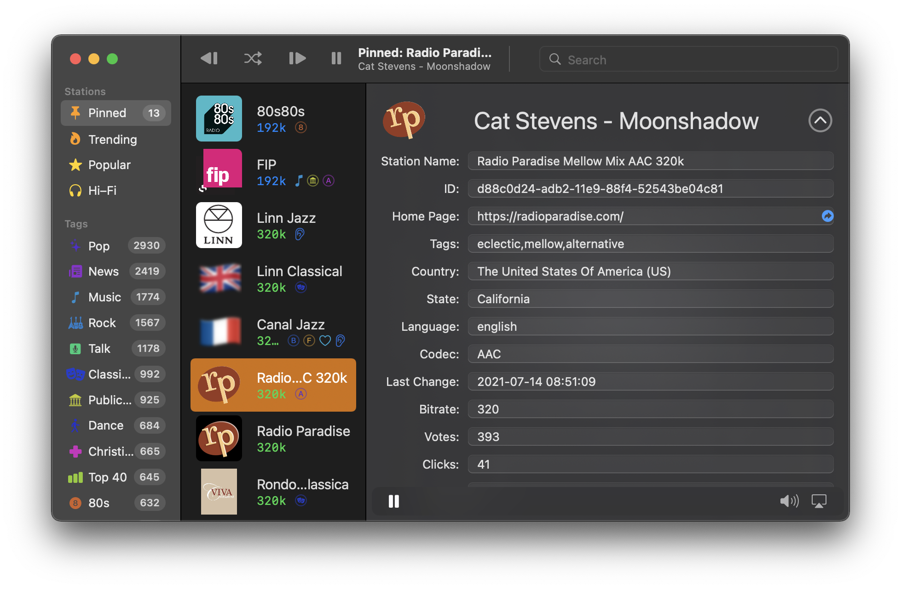

# Tune Out!

Tune Out is a free [App Fair](https://www.appfair.net) app
for browsing and listening to internet radio stations.

It includes 30,000 stations from sources such as the free
[RadioBrowser](https://www.radio-browser.info/) catalog.




## Description

Tune Out is a free internet radio app with a catalog of over 30,000
stations from around the world.


## Installation

### App Fair Installation

Tune Out can be installed with the [App Fair.app](https://www.appfair.net)
by launching: [appfair://app/Tune-Out](appfair://app/Tune-Out)

### Homebrew Installation

[Homebrew](https://brew.sh/) users on macOS can alternatively
install tune out directly with the command:

```shell
$ brew install appfair/app/tune-out
```

The app will be installed in the `/Applications/App Fair/` folder.
It can be un-installed by dragging it to the Trash.

## Support

Community Support for Tune Out is available from its
[Discussion](../../discussions) forums.

Issue reports and suggestions for improvement are available from the
[Issues](../../issues) page.

## License

    This program is free software: you can redistribute it and/or modify
    it under the terms of the GNU Affero General Public License as published
    by the Free Software Foundation.

## FAQ

### Does Tune Out use tracking or advertising?

Tune Out is a zero telemetry application.
It sends no identifying information to any individual stations or sites.
The individual stations, however, may elect to serve advertisements
in their content streams.
Since your approximate geographical location can be inferred
from your IP address, this may result in hearing advertisements
that are local to your network entry point, even for stations
originating from another country.

### Where does Tune Out get its station list?

Tune Out uses the station database from the free
[RadioBrowser](https://www.radio-browser.info/) catalog.


## TODO:

  - [ ] Make form un-editable
  - [ ] Merge play/pause buttons 
  - [ ] Table-based frame browsing
  - [ ] Languages section in sidebar
  - [ ] Display video streams ("MP3,H.264", "AAC+,H.264")
  - [ ] Make Countries section collapsed by default
  - [ ] Place "Pinned" badge inside chevron
  - [ ] App preferences:
    1. [ ] Default visible tags
    1. [ ] Visible bitrate range


## Development

This project contains the shell of an [App Fair](https://www.appfair.net) app,
which is an application distribution platform for native SwiftUI applications.

Fork this project into an organization to use as the basis for your own app,
then submit a PR to have it automatically built and distributed
through the [App Fair.app catalog browser for macOS](https://www.appfair.net).

To get started building your own app using only your web browser:

1. Create a [new free GitHub Organization](https://github.com/account/organizations/new?plan=team_free).
   The organization's name will uniquely identify your app and
   should consist of two short words (no numbers) separated by a single hyphen.
   For example: `App-Name`.
1. Set the public e-mail in the Organization settings to be to same
   as your public GitHub e-mail address.
1. [Fork the appfair/App repository](https://github.com/appfair/App/fork)
   into your new `App-Name` organization. The fork must reside in
   an organization rather than your personal account.
1. Open the App fork's `About` panel and set the description to be
   a brief (< 80 character) single-sentence summary of your application,
   then add a single topic starting with "appfair-",
   such as `appfair-utilities`.
1. Update your App fork's [settings](../../settings#features) to
   enable **Issues** and **Discussions**.
1. [Edit Info.plist](../../edit/main/Info.plist) and update
   the `CFBundleName` to be `App Name` (the app name with a space)
   and `CFBundleIdentifier` to be `app.App-Name`.
1. [Edit this README.md](../../edit/main/README.md) file to
   describe and document your app. The `#Description` section will
   be published as part of your App's catalog information.
1. [Edit Sources/App/AppContainer.swift](../../edit/main/Sources/App/AppContainer.swift)
   and add some SwiftUI code to the `ContentView.body`.
1. [Enable actions](../../actions) for the App fork, which will be used
   to validate the App settings, as well as build and publish releases.
1. Create a [new 0.0.1 release](../../releases/new?target=main&tag=0.0.1)
   for the `main` branch and `Publish release`. The release tag should
   match the `CFBundleShortVersionString` key in the `Info.plist` file.
   Release notes can be entered into the description.
1. Wait for the [release action](../../actions) to complete successfully,
   then verify that the release artifacts are available on the
   [releases page](../../releases).
1. [Create a Pull Request (PR)](../../compare) to the the base `/appfair/App/`
   repository with the title: `app.App-Name` (matching the `CFBundleIdentifier`
   in the `Info.plist` file).
1. Submit the PR and monitor the status of its check actions,
   which will validate the app release and update the App Fair catalog.
   The PR will be closed automatically once it has completed.

Your successful release build will shortly become available in
the [App Fair](https://www.appfair.net) catalog browser application,
as well as automatically published to the homebrew catalog, from where
it can be installed with:

```shell
$ brew install appfair/app/app-name
```

Download, share and enjoy!

